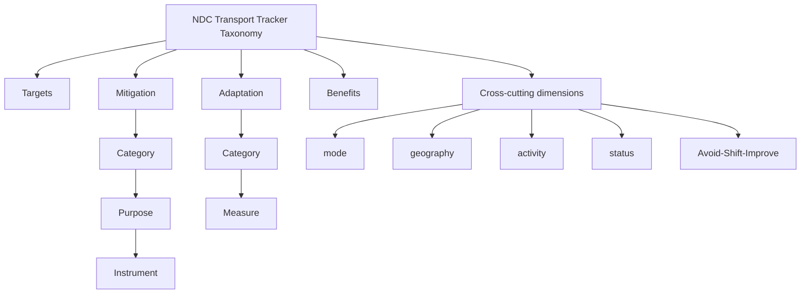
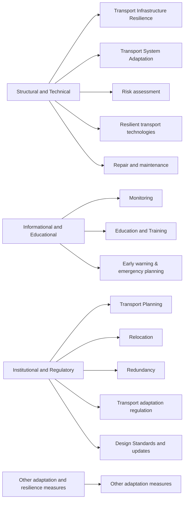
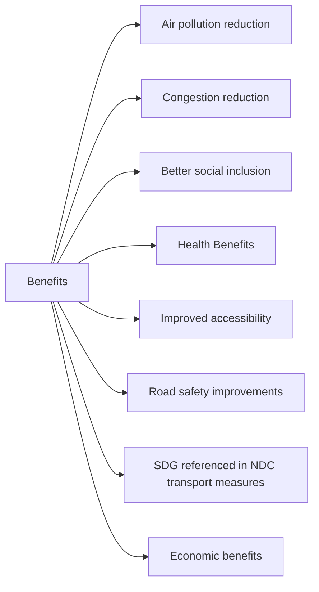

# NDC Transport Tracker — Taxonomy

**Version 4.0** · source workbook `NDC-taxonomy.xlsx` · last updated 2026-05-05 · licensed CC BY 4.0

> GIZ and SLOCAT (2025). NDC Transport Tracker (vers. 4.0). Available from: www.changing-transport.org/tracker.

This document is the full classification taxonomy used by the NDC Transport Tracker and the Transport Policy Miner pipeline. It is available in three forms in this directory:

- [`ndc_taxonomy.json`](./ndc_taxonomy.json) — machine-readable
- [`ndc_taxonomy.csv`](./ndc_taxonomy.csv) — spreadsheet
- this file, with rendered diagrams

## Structure at a glance

The taxonomy has four **domains** (Targets, Mitigation, Adaptation, Benefits). Each domain is split into one or more **dimensions**. Some dimensions are flat lists of values; others are hierarchical (a value opens into child values). On top of these, several **cross-cutting dimensions** (mode, geography, activity, status, Avoid-Shift-Improve) are tagged onto individual measures.

---
## 1. Targets

A target expresses a goal or objective related to lowering GHG emissions or adapting to climate impacts. Targets are classified across six independent dimensions.

```mermaid
graph LR
  T["Targets"]
  T --> n825399373("Target area")
  n825399373 --> n929400916["Net zero target"]
  n825399373 --> n29631898["Overall mitigation target"]
  n825399373 --> n715989283["Transport sector mitigation target"]
  n825399373 --> n31078639["Transport sector adaptation target"]
  n825399373 --> n516776713["Energy sector target"]
  T --> n659820389("Conditionality")
  n659820389 --> n805278221["Unconditional"]
  n659820389 --> n520040948["Conditional"]
  n659820389 --> n126658008["Unclear conditionality"]
  T --> n237113218("GHG target?")
  n237113218 --> n877392677["GHG"]
  n237113218 --> n53490759["Non-GHG"]
  T --> n339393583("Target type")
  n339393583 --> n856756197["GHG: Base year"]
  n339393583 --> n31237551["GHG: BAU"]
  n339393583 --> n943362609["GHG: Fixed level"]
  n339393583 --> n90059768["GHG: Base year intensity"]
  n339393583 --> n383939700["GHG: Trajectory"]
  n339393583 --> n201391940["Other GHG targets"]
  n339393583 --> n911199459["Renewable energy"]
  n339393583 --> n555940269["Other non-GHG energy targets"]
  n339393583 --> n415614463["Avoid targets"]
  n339393583 --> n784682314["Mode share targets"]
  n339393583 --> n389609607["Infrastructure targets"]
  n339393583 --> n379651021["Vehicle efficiency targets"]
  n339393583 --> n11147565["Zero emission vehicle targets"]
  n339393583 --> n961661383["Biofuel targets"]
  n339393583 --> n649111304["Renewable energy in transport targets"]
  n339393583 --> n666157284["Non-national transport GHG mitigation target"]
  n339393583 --> n973149438["Other non-GHG transport targets"]
  n339393583 --> n462559778["General adaptation targets"]
  T --> n209127231("Target scope")
  n209127231 --> n782066260["Overall mitigation target"]
  n209127231 --> n433041184["Sector-wide"]
  n209127231 --> n368930736["Subsector targets"]
  n209127231 --> n423563917["Unclear scope"]
  T --> n230008241("ICE phase-out target type")
  n230008241 --> n709512219["Sales all vehicles"]
  n230008241 --> n511656014["Sales cars"]
  n230008241 --> n661260725["Sales public transport"]
  n230008241 --> n662655453["Sales unclear scope"]
  n230008241 --> n108986106["Fleet all vehicles"]
  n230008241 --> n69247341["Fleet cars"]
  n230008241 --> n333812876["Fleet public transport"]
  n230008241 --> n398685320["Fleet unclear scope"]
  n230008241 --> n923813326["Other ICE phase-out targets"]
```

<b>Target area</b> (5 values)

| Label | Code | Parent | Definition | Suggested clarification | Source |
|---|---|---|---|---|---|
| Net zero target | `T_Netzero` |  | This parameter captures any economy-wide net zero targets. |  |  |
| Overall mitigation target | `T_Economy` |  | A reduction target for greenhouse gas emissions (covering CO2 and other relevant greenhouse gases) has been set for the whole economy or collectively for all sectors covered in the document. |  |  |
| Transport sector mitigation target | `T_Transport` |  | A greenhouse gas emission mitigation target has been set for transport or a transport subsector on the national level. |  |  |
| Transport sector adaptation target | `T_Adaptation` |  | A quantifiable target has been set for transport adaptation and resilience on the national level. |  |  |
| Energy sector target | `T_Energy` |  | A mitigation target for the energy sector (and thus indirectly for transport) has been adopted on the national level. Any transport-related figure presented within the energy target is counted exclusively as a transport target. |  |  |

<b>Conditionality</b> (3 values)

| Label | Code | Parent | Definition | Suggested clarification | Source |
|---|---|---|---|---|---|
| Unconditional | `T_Unconditional` |  | This target is not conditional or contingent upon any other developments. |  |  |
| Conditional | `T_Conditional` |  | This target is conditional or contingent upon international/external support. |  |  |
| Unclear conditionality | `T_Unclear` |  | The document is not clear whether the target is unconditional or conditional. |  |  |

<b>GHG target?</b> (2 values)

| Label | Code | Parent | Definition | Suggested clarification | Source |
|---|---|---|---|---|---|
| GHG | `T_GHG` |  | The target specifies a value in terms of GHG that will be reduced or avoided |  |  |
| Non-GHG | `T_NONGHG` |  | The target DOES NOT specifiy a value in terms of GHG that will be reduced or avoided |  |  |

<b>Target type</b> (18 values)

| Label | Code | Parent | Definition | Suggested clarification | Source |
|---|---|---|---|---|---|
| GHG: Base year | `T_BYE` | T_GHG | A commitment to reduce, or control the increase of, emissions by a specified quantity relative to a historical base year. For example, a 25% reduction from 1990 levels by 2020. These are sometimes referred to as “absolute” targets. |  |  |
| GHG: BAU | `T_BAU` | T_GHG | A commitment to reduce emissions by a specified quantity relative to a projected emissions baseline scenario |  |  |
| GHG: Fixed level | `T_FL` | T_GHG | A commitment to reduce, or control the increase of, emissions to a specified emissions quantity in a target year/period. Fixed-level target include carbon neutrality targets or phase-out targets, which aim to reach zero net emissions by a specified date. For example, zero net emissions by 2050. |  |  |
| GHG: Base year intensity | `T_BYI` | T_GHG | A commitment to reduce emissions intensity (emissions per unit of another variable, typically GDP) by a specified quantity relative to a historical base year. For example, a 40% reduction below 1990 base year intensity by 2020. |  |  |
| GHG: Trajectory | `T_TRA` | T_GHG | A commitment to reduce, or control the increase of, emissions to specified emissions quantities in multiple target years or periods over a long time period (such as targets for 2020, 2030, and 2040 over the period 2020- 2050). Trajectory targets also include “peak-and decline” targets. |  |  |
| Other GHG targets | `T_Other` | T_GHG | GHG targets that do not fit in any other indicator |  |  |
| Renewable energy | `T_E_REN` | T_Energy / T_NONGHG | A mitigation target for renewable energy such as capacity or production targets |  |  |
| Other non-GHG energy targets | `T_E_ENERGY` | T_Energy / T_NONGHG | Other non-GHG energy targets |  |  |
| Avoid targets | `T_O_AVOID` | T_Transport / T_NONGHG | Non-GHG transport targets only: targets related to avoided travel |  |  |
| Mode share targets | `T_O_MODE` | T_Transport / T_NONGHG | Non-GHG transport targets only: targets related to changes in mode share |  |  |
| Infrastructure targets | `T_O_INFRA` | T_Transport / T_NONGHG | Non-GHG transport targets only: targets related to infrastructure investment or specific amounts of infrastructure constructed |  |  |
| Vehicle efficiency targets | `T_O_EFF` | T_Transport / T_NONGHG | Non-GHG transport targets only: targets related to changes in vehicle efficiency |  |  |
| Zero emission vehicle targets | `T_O_ZERO` | T_Transport / T_NONGHG | Non-GHG transport targets only: targets related to electrification of vehicles and introduction of zero emission vehicles |  |  |
| Biofuel targets | `T_O_BIO` | T_Transport / T_NONGHG | Non-GHG transport targets only: targets related to biofuel |  |  |
| Renewable energy in transport targets | `T_O_REN` | T_Transport / T_NONGHG | Non-GHG transport targets only: targets related to renewable energy use in transport in general |  |  |
| Non-national transport GHG mitigation target | `T_O_SUBGHG` | T_Transport / T_NONGHG | Non-GHG transport targets only: targets focusing on transport GHG mitigation reduction on a subnational level (NEW) |  |  |
| Other non-GHG transport targets | `T_O_Other` | T_Transport / T_NONGHG | Non-GHG transport targets that do not fit in any other indicator |  |  |
| General adaptation targets | `T_A_GEN` | T_Adaptation / T_NONGHG | All adaptation targets (could be further refined) |  |  |

<b>Target scope</b> (4 values)

| Label | Code | Parent | Definition | Suggested clarification | Source |
|---|---|---|---|---|---|
| Overall mitigation target | `T_ALL_E` | T_Netzero, T_Economy | Targets that cover the whole economy |  |  |
| Sector-wide | `T_ALL_S` | T_Transport, T_Adaptation, T_Energy | Targets that cover the total sector for transport, energy, renewables and adaptation targets |  |  |
| Subsector targets | `T_SUB_S` | T_Transport, T_Adaptation, T_Energy | Targets that cover one sector more specified sub-subsectors of the transport, energy or renewables sector or for adaptation |  |  |
| Unclear scope | `T_UNCL` | T_Netzero, T_Economy, T_Transport, T_Adaptation, T_Energy | Targets where the scope is not clear |  |  |

<b>ICE phase-out target type</b> (9 values)

| Label | Code | Parent | Definition | Suggested clarification | Source |
|---|---|---|---|---|---|
| Sales all vehicles | `ICE_SALES_ALL` |  | Targets that declare a general ban to sell of new ICE vehicles in a market  by a specific point of time. |  |  |
| Sales cars | `ICE_SALES_CAR` |  | Targets that declare a ban to sell new ICE cars in the market by a specific point of time. |  |  |
| Sales public transport | `ICE_SALES_PT` |  | Targets that declare a ban to sell new ICE public transport vehicles in the market  by a specific point of time. |  |  |
| Sales unclear scope | `ICE_SALES_U` |  | Targets that declare a ban to sell new ICE vehicles in the market  by a specific point of time. The scope of vehicles targeted is not clear. |  |  |
| Fleet all vehicles | `ICE_FLEET_ALL` |  | Targets that declare a general ban to use of ICE vehicles as part of a fleet  by a specific point of time. |  |  |
| Fleet cars | `ICE_FLEET_CAR` |  | Targets that declare a ban to use ICE cars as part of a fleet  by a specific point of time. |  |  |
| Fleet public transport | `ICE_FLEET_PT` |  | Targets that declare a  ban to use ICE public transport vehicles as part of a fleet  by a specific point of time. |  |  |
| Fleet unclear scope | `ICE_FLEET_U` |  | Targets that declare a  ban to use ICE  vehicles as part of a fleet  by a specific point of time. The scope of vehicles targeted is not clear. |  |  |
| Other ICE phase-out targets | `ICE_OTHER` |  |  |  |  |

---
## 2. Mitigation measures

A mitigation measure is an action or pathway that leads to lowering GHG emissions. Mitigation is a three-level hierarchy: **Category → Purpose → Instrument**. An instrument always belongs to one purpose, and a purpose to one category.

```mermaid
graph LR
  n588751609["Mode shift and demand management"]
  n355397775("Transport demand management")
  n588751609 --> n355397775
  n355397775 --> n246836502["Transport demand management measures"]
  n355397775 --> n236404300["Car access restriction and low emission zones"]
  n355397775 --> n905005124["Commuter trip reduction policies"]
  n355397775 --> n740603646["Parking measures"]
  n573181499("Economic conditions for sustainable transport")
  n588751609 --> n573181499
  n573181499 --> n117022385["General economic instruments"]
  n573181499 --> n472779735["Emissions trading and carbon pricing"]
  n573181499 --> n554711177["Financial instruments to support decarbonisation"]
  n573181499 --> n941527149["Fossil fuel subsidy elimination"]
  n573181499 --> n34953873["Fuel taxation"]
  n573181499 --> n984444738["Green public procurement"]
  n573181499 --> n765300709["Road charging and tolls"]
  n573181499 --> n488137194["Vehicle taxation"]
  n757402768("Digital solutions")
  n588751609 --> n757402768
  n757402768 --> n44769026["Measures supporting autonomous vehicles"]
  n757402768 --> n740951311["Data and modelling improvements"]
  n757402768 --> n906470301["General innovations and digitalization"]
  n757402768 --> n828008854["Intelligent transport systems"]
  n757402768 --> n735723452["Shared mobility"]
  n828271349("Promote active mobility")
  n588751609 --> n828271349
  n828271349 --> n128628533["General active mobility"]
  n828271349 --> n612646100["Cycling measures"]
  n828271349 --> n92283735["Walking measures"]
  n59071491("Public transport improvement")
  n588751609 --> n59071491
  n59071491 --> n127734009["BRT"]
  n59071491 --> n240960123["Public transport integration and expansion"]
  n59071491 --> n848380484["Express lanes/ public transport priority"]
  n59071491 --> n296017687["General public transport improvement"]
  n114573340["Transport system improvements"]
  n752095233("Enhance comprehensive transport planning")
  n114573340 --> n752095233
  n752095233 --> n553932086["General transport and land use planning"]
  n752095233 --> n258145364["Traffic management improvements"]
  n752095233 --> n21152068["National mobility plans"]
  n752095233 --> n431544979["Sustainable urban mobility plans"]
  n752095233 --> n933643168["Access improvement instruments (density, mixed use)"]
  n302104160("Improve infrastructure")
  n114573340 --> n302104160
  n302104160 --> n593549867["Expansion of infrastructure"]
  n302104160 --> n106990155["Infrastructure improvements"]
  n302104160 --> n416153908["Intermodality measures"]
  n966816735("Freight efficiency improvements")
  n114573340 --> n966816735
  n966816735 --> n801488947["General freight efficiency improvements"]
  n966816735 --> n369103490["Improving load"]
  n966816735 --> n411996977["Freight transport shifting to rail or inland waterways"]
  n429352854("Education and behavioral change")
  n114573340 --> n429352854
  n429352854 --> n765602015["Ecodriving"]
  n429352854 --> n380011272["General education and behavior change"]
  n918062944["Energy efficiency"]
  n992430018("Promote vehicle improvements")
  n918062944 --> n992430018
  n992430018 --> n668000664["Labelling requirements"]
  n992430018 --> n502296591["Vehicle air pollution emission standards"]
  n992430018 --> n944689307["Fuel quality improvements"]
  n992430018 --> n186742072["Inspection and maintenance"]
  n992430018 --> n12868305["Vehicle efficiency standards"]
  n992430018 --> n412090038["General vehicle improvement measures"]
  n992430018 --> n759987414["Vehicle restrictions (import, age, access, sale, taxation)"]
  n992430018 --> n303614167["Vehicle scrappage scheme"]
  n775860257["Electrification"]
  n348738695("Promote electric mobility")
  n775860257 --> n348738695
  n348738695 --> n503890081["General e-mobility measures"]
  n348738695 --> n740983622["EV charging infrastructure measures"]
  n348738695 --> n132328747["EV purchase incentives"]
  n348738695 --> n171220670["Smart charging policies"]
  n348738695 --> n987412341["General micromobility"]
  n93185375["Alternative fuels"]
  n551069581("Promote alternative fuels")
  n93185375 --> n551069581
  n551069581 --> n45361958["General alternative fuels measures"]
  n551069581 --> n766549306["Low emission vehicle purchase incentives"]
  n551069581 --> n643513061["Biofuels support measures"]
  n551069581 --> n526866587["Hydrogen support measures"]
  n551069581 --> n991519204["LPG/CNG/LNG support measures"]
  n551069581 --> n153055476["General renewable energy support measures"]
  n716351186["Aviation and maritime"]
  n49580772("Promote improvements in aviation")
  n716351186 --> n49580772
  n49580772 --> n872356898["Aircraft fleet renovation"]
  n49580772 --> n572036449["Air traffic management"]
  n49580772 --> n589314823["General aviation improvements"]
  n49580772 --> n282253366["Airport CO2 certification"]
  n49580772 --> n778986755["Jet fuel policies"]
  n866890644("Promote improvements in shipping")
  n716351186 --> n866890644
  n866890644 --> n262955987["Support on-shore power and electric charging facilities in ports"]
  n866890644 --> n567371774["Port infrastructure improvements"]
  n866890644 --> n816500552["Ship efficiency improvements"]
  n866890644 --> n416082603["General shipping improvement"]
```

<b>Categories</b> (top level)

| Label | Code | Definition | Suggested clarification | Source |
|---|---|---|---|---|
| Mode shift and demand management | `C_Mode` | This category is for measures that encourage more environmentally friendly transport modes or that reduce overall demand for motorised transport. It includes several pricing-related measures (taxes, subsidies and other economic instruments). |  |  |
| Transport system improvements | `C_System` | This category is for mitigation measures that address the entire transport system and closely related sectors. It covers planning, land use and infrastructure measures, but also considers transport system improvements, intelligent transport systems,  freight demand management and transport-related education activities. |  |  |
| Energy efficiency | `C_Efficiency` | This category is used for measures that seek to improve the energy efficiency of vehicles and the transport system as a whole. |  |  |
| Electrification | `C_Electrification` | This category includes mitigation measures that focus on the electrification of transport, including electric vehicle uptake, purchase incentives and charging |  |  |
| Alternative fuels | `C_Fuels` | This category considers measures related to the use of alternative fuels (e.g. ethanol, hydrogen, LPG) except for electric mobility |  |  |
| Aviation and maritime | `C_Innovation` | This category includes innovations in aviation, shipping. They are treated as a category apart because they represent areas, for which few mitigation options exist. |  |  |

<b>Purposes</b> (mid level, with parent category)

| Label | Code | Parent | Definition | Suggested clarification | Source |
|---|---|---|---|---|---|
| Transport demand management | `P_TDM` | C_Mode | This purpose covers various strategies that address transport demand. Such measures aim to act on the transport demand (km traveled) and the choice of modes by encouraging low-carbon modes (such as walking, cycling or public transport) and discouraging the use of high-emission modes. |  |  |
| Economic conditions for sustainable transport | `P_Sustainable` | C_Mode | This purpose refers to the overarching economic structures and conditions in which people make transport-related choices (such as buying a vehicle, chosing a mode to travel). It covers green procurement, carbon-related pricing and finance mechanisms as well as taxes and subsidies for transport decarbonization. |  |  |
| Digital solutions | `P_DigitalEff` | C_Mode | This purpose groups measures that enhance the efficiency of modes/transport systems through digital solutions |  |  |
| Promote active mobility | `P_Active` | C_Mode | This purpose groups measures that contribute to promoting active mobiliy (also called non-motorised transport), such as cycling and warlking, wheelchair movement |  |  |
| Public transport improvement | `P_Public` | C_Mode | The purporse  covers all measures designed to improve or further develop the public transport system. |  |  |
| Enhance comprehensive transport planning | `P_Planning` | C_System | This purpose considers planning tools and overall planning frameworks to support sustainable transport. |  |  |
| Improve infrastructure | `P_Infrastructure` | C_System | This purpose covers measures that focus on improving and expanding infrastructure and its utilization and ensure intermodality by interlinking different modes of transport. |  |  |
| Freight efficiency improvements | `P_Freight` | C_System | This purpose covers measures for the improvement of the freight transport system. |  |  |
| Education and behavioral change | `P_Education` | C_System | This purpose covers measures targeting a change of behaviour through education and awareness |  |  |
| Promote vehicle improvements | `P_Vehicles` | C_Efficiency | This purpose refers to  improvements that enhance the energy efficiency of  vehicles. |  |  |
| Promote electric mobility | `P_Electric` | C_Electrification | This purpose covers measures that seek to foster the transition to electric mobility. |  |  |
| Promote alternative fuels | `P_Altfuel` | C_Fuels | This purpose considers measures aimed at promoting the use of alternative fuels. |  |  |
| Promote improvements in aviation | `P_Aviation` | C_Innovation | This purpose considers measures aimed at promoting technical improvement in the aviation sector. |  |  |
| Promote improvements in shipping | `P_Shipping` | C_Innovation | This purpose considers measures aimed at promoting technical improvement in the shipping sector. |  |  |

<b>Instruments</b> (leaf level, with parent category / purpose)

| Label | Code | Parent | Definition | Suggested clarification | Source |
|---|---|---|---|---|---|
| Transport demand management measures | `A_TDM` | C_Mode / P_TDM | This parameter records any general mention of activities focusing on reducing demand for motorized transport. |  |  |
| Car access restriction and low emission zones | `A_Caraccess` | C_Mode / P_TDM | This parameter refers to car access measures that restrict the physical access of certain types of vehicles to certain places (e.g. city centres). An example are Low Emission Zones. By resticting access based on certain criteria (type of propulsion technique, euro-Standards, age etc) access limitations can have differentiated impact such as GHG emissions reductions, air pollutants reduction and congestion prevention. They can encourage the use of low-carbon modes like cycling and public transport and/or support technological shift to cleaner technologies. | This parameter refers to measures that restrict the physical access of certain vehicle types to certain places (e.g. city centres); Low Emission Zones are one example. By restricting access based on criteria such as propulsion technology, Euro standard or age, these measures can deliver differentiated impacts (GHG reduction, lower air pollution, congestion prevention) and can encourage low-carbon modes and a shift to cleaner technologies. |  |
| Commuter trip reduction policies | `A_Commute` | C_Mode / P_TDM | This parameter refers to the management of circumstances and incentives for employee commuter travel and working arrangements to reduce traffic and automobile use. |  | ITDP (2013), p. 32 |
| Parking measures | `S_Parking` | C_Mode / P_TDM | This parameter refers to actions that aim to improve parking management such as pricing, quantity restrictions, parking reform etc. which then also contribute to a reduced demand of motorised travel. |  |  |
| General economic instruments | `A_Economic` | C_Mode / P_Sustainable | This parameter records any general mention of economic instruments, such as taxes& tax breaks, fees, duties and subsidies, which contribute to integrating  environmental costs and benefits into the budgets of households and firms. |  | OECD, Glossary of Statistical Terms |
| Emissions trading and carbon pricing | `A_Emistrad` | C_Mode / P_Sustainable | This parameter refers to emissions trading systems (ETS) or cap-and-trade systems:  a pricing mechanism for emitted greenhouse gas emissions. Unlike a direct carbon tax, where the unit price of CO2 is fixed, under an emissions trading scheme, the price per tonne of CO2 varies. The overall amount of emissions is fixed for a given period of time (e.g. annually). Entities are allocated a set amount of CO2 emissions allowances, or quotas, and trade emissions with each another. Those able to reduce their emissions below their allowance level can trade them with those emitting in excess of their allowance. |  | ITF (2020): Emissions trading (aviation) |
| Financial instruments to support decarbonisation | `A_Finance` | C_Mode / P_Sustainable | This parameter records financing instruments used to pay for technologies, projects and programmes that reduce GHG emissions. Financing instruments that aim to support decarbonization include climate finance solutions, investments in EVs, green bonds, etc. Not to confound with economic instruments! | This parameter records financing instruments used to pay for technologies, projects and programmes that reduce GHG emissions, e.g. climate finance solutions, investments in EVs, green bonds. Not to be confused with economic instruments. | ITF (2020): Financial instruments to support decarbonisation |
| Fossil fuel subsidy elimination | `A_Fossilfuelsubs` | C_Mode / P_Sustainable | This parameter refers to policies and decisions that eliminate or reduce subsidies for fossil fuels. Energy subsidies are used by governments to lower the cost of producing or consuming fossil fuels. Eliminating such subsidies can help to reduce reliance on fossil fuels. |  |  |
| Fuel taxation | `A_Fueltax` | C_Mode / P_Sustainable | This parameter records national or local taxes on the sale of fuel. Every fuel type is taxed differently. One target of taxing fuel is to reduce fuel consumption and encourage more efficient transport modes. |  |  |
| Green public procurement | `A_Procurement` | C_Mode / P_Sustainable | This parameter refers to stakeholders to taking into account environmental impacts when procuring goods and services. Applied to transport, it means that a public authority can develop green procurement regulations that, for example, only allow the purchase of zero-emission vehicles. Such measures can support the transition to cleaner public vehicle fleets and more sustainable consumption. |  | ITF (2020): Green public procurement |
| Road charging and tolls | `A_Roadcharging` | C_Mode / P_Sustainable | This parameter refers to surcharges applied to general or specific road use, including in particular highway tolls. This includes congestion pricing. |  |  |
| Vehicle taxation | `A_Vehicletax` | C_Mode / P_Sustainable | This parameter refers to  taxes on vehicle pruchase and/or ownership |  | ITF (2020): Vehicle purchase and ownership taxes |
| Measures supporting autonomous vehicles | `I_Autonomous` | C_Mode / P_DigitalEff | This parameter identifies measures that promote self-driving vehicles, artificial intelligence and any other mechanisms that support the automation of passenger and freight transport. |  |  |
| Data and modelling improvements | `I_DataModelling` | C_Mode / P_DigitalEff | This parameter identifies any measures related to transport data (e.g. collection, analysis or application) as well as models designed to predict traffic flows or transport demand growth. |  |  |
| General innovations and digitalization | `I_Other` | C_Mode / P_DigitalEff | This parameter includes activities that mention the use of innovation and digitalization to improve the efficiency of transport. |  |  |
| Intelligent transport systems | `I_ITS` | C_Mode / P_DigitalEff | This parameter refers to intelligent transport systems that  harness technology to improve the management and operation of transport services. Relevant technologies include sensors, wireless communications, notification systems and other ICT solutions. |  |  |
| Shared mobility | `S_Sharedmob` | C_Mode / P_DigitalEff | This parameter includes general measures in the area of shared mobility, such as bike sharing, car-sharing, shared scooters etc.. |  |  |
| General active mobility | `S_Activemobility` | C_Mode / P_Active | This parameter is used for general measures that refer to walking and cycling are included here. | General measures that refer to walking and cycling are included here. |  |
| Cycling measures | `S_Cycling` | C_Mode / P_Active | This parameter covers any action that specifically mentions improving cycling is included here. | Any action that specifically mentions improving cycling is included here. |  |
| Walking measures | `S_Walking` | C_Mode / P_Active | This parameter covers any action that specifically mentions improving walking is included here. | Any action that specifically mentions improving walking is included here. |  |
| BRT | `S_BRT` | C_Mode / P_Public | This parameter refers to Bus rapid transit (BRT): a bus system with high speed, capacity, punctuality and operating flexibility. Common characteristics of a BRT system include the use of bus-only lanes, advance ticketing, and articulated buses. |  | ITF (2020): Bus rapid transit network |
| Public transport integration and expansion | `S_PTIntegration` | C_Mode / P_Public | This parameter covers activities that aim to expand public transport or integrate different public transport services into a single system. |  |  |
| Express lanes/ public transport priority | `S_PTPriority` | C_Mode / P_Public | This parameter looks at actions that give priority to public transport over other modes. Examples include transit signal priorities, access priority, intelligent transport systems and express lanes. |  | ITF (2020): Express lanes/public transport priority |
| General public transport improvement | `S_PublicTransport` | C_Mode / P_Public | This parameter covers all activities that aim to improve the public transport system. |  |  |
| General transport and land use planning | `A_Complan` | C_System / P_Planning | This parameter records any general mention of transport planning. |  | VTI (2015): Comprehensive Transport Planning |
| Traffic management improvements | `A_LATM` | C_System / P_Planning | This parameter looks at management, infrarstructure and techonlogical approaches with the goal of improving traffic flow. | This parameter looks at management, infrastructure and technological approaches with the goal of improving traffic flow. |  |
| National mobility plans | `A_Natmobplan` | C_System / P_Planning | A national mobility plan provides a comprehensive long-term planning framework for the transport sector. It features a vision and timeframes for action at the national level. This parameter records these planning activities that focus on nationwide transport. |  |  |
| Sustainable urban mobility plans | `A_SUMP` | C_System / P_Planning | A sustainable urban mobility plan (SUMP) is “a strategic plan designed to satisfy the mobility needs of people and businesses in cities and their surroundings for a better quality of life. It builds on existing planning practices and takes due consideration of integration, participation and evaluation principles”. If the document refers to a SUMP or an integrated approach on urban mobility, this is captured here. | A sustainable urban mobility plan (SUMP) is a strategic plan designed to satisfy the mobility needs of people and businesses in cities and their surroundings for a better quality of life. It builds on existing planning practices and gives due consideration to integration, participation and evaluation principles. Captured here when a document refers to a SUMP or an integrated urban mobility approach. | European Commission (n.d.) |
| Access improvement instruments (density, mixed use) | `A_Mixuse` | C_System / P_Planning | This parameter captures different features of the urban built environment that contribute to low mileage and sustainble travel patterns. This inclues urban density, land-use diversity "mixed used" and enhanced accessibility. |  |  |
| Expansion of infrastructure | `S_Infraexpansion` | C_System / P_Infrastructure | This parameter refers to activities that aim to introduce new infrastructure or expand infrastructure for transport . If a measure is dedicated to a specific transport mode, then it might be captured under that specific parameter. Any general mention of expanding transport infrastructure is collected here. |  |  |
| Infrastructure improvements | `S_Infraimprove` | C_System / P_Infrastructure | This parameter is for measures that outline general improvements in transport infrastructure or the transport system as a whole, without providing details about specific measures. |  |  |
| Intermodality measures | `S_Intermodality` | C_System / P_Infrastructure | Intermodality is the combination of different transport modes with the goal of enabling convenient, seamless transfer between them. Any general activities that highlight intermodality but do not specify actions are included here. |  |  |
| General freight efficiency improvements | `I_Freighteff` | C_System / P_Freight | This parameter records general efficiency improvements in freight. If the document does not specify a specific activity or action that belongs to the other freight efficiency activities, then it is captured here. |  |  |
| Improving load | `I_Load` | C_System / P_Freight | This parameter is for measures that encourage reliance on high-capacity vehicles (trains, ships, etc.) in order to achieve lower carbon intensity per ton transported. |  |  |
| Freight transport shifting to rail or inland waterways | `S_Railfreight` | C_System / P_Freight | In freight transport, intermodality often entails a shift to less carbon-intensive transport modes (e.g. rail and waterborne transport). This parameter records any actions that support a shift of road freight to rail or waterways. |  |  |
| Ecodriving | `I_Ecodriving` | C_System / P_Education | Ecodriving refers to educational measures that encourage more efficient driving practices. Such practices can reduce fuel consumption and are captured in this parameter. | Ecodriving refers to educational measures that encourage more efficient driving practices, which can reduce fuel consumption. Captured under this parameter. |  |
| General education and behavior change | `I_Education` | C_System / P_Education | This parameter is for general educational activities and behavioral change related to transport, e.g. concerning the environmental impacts of private vehicle use, the benefits of electric vehicles, etc. | This parameter is for general educational activities and behavioural change related to transport (e.g. the environmental impacts of private vehicle use, the benefits of electric vehicles, etc.). |  |
| Labelling requirements | `I_Vehiclelabel` | C_Efficiency / P_Vehicles | This parameter refers to measures requiring publication of information on environment impacts, this environmental impact can be GHG emissions, fuel consumption, carbon intesntiy of a fuel or local pollutants. All of the different labels are captured under this parameter. |  |  |
| Vehicle air pollution emission standards | `I_Efficiencystd` | C_Efficiency / P_Vehicles | This parameter captures emission standards that regulate air pollution exhaust emission(such as NOx) such as the EURO standards Euro1-6 (not referring to CO2 standards) | This parameter captures emission standards regulating air-pollutant exhaust emissions (such as NOx), e.g. the EURO standards Euro 1-6 (not referring to CO2 standards). |  |
| Fuel quality improvements | `I_Fuelqualimprove` | C_Efficiency / P_Vehicles | A high-quality fuel contains very low levels of sulfur. Countries set fuel quality standards in order to guarantee fuel quality. This parameter covers any mention of clean fuels or better fuel quality in the transport sector |  |  |
| Inspection and maintenance | `I_Inspection` | C_Efficiency / P_Vehicles | A well-maintained vehicle can ensure higher energy efficiency. This parameter considers measures that pertain to vehicle inspections or maintenance. |  |  |
| Vehicle efficiency standards | `I_Vehicleeff` | C_Efficiency / P_Vehicles | This parameter captures measures designed to improve vehicle efficiency or lower transport emissions. This is done through fuel economy  (or CO2) standards, which regulate how far a vehicle must travel when consuming a given quantity of fuel (e.g. in liters per 100 km or miles per gallon or CO2/100km). |  |  |
| General vehicle improvement measures | `I_Vehicleimprove` | C_Efficiency / P_Vehicles | This parameter identifies any general vehicle improvement measures that are included in the document. |  |  |
| Vehicle restrictions (import, age, access, sale, taxation) | `I_VehicleRestrictions` | C_Efficiency / P_Vehicles | This parameter encompasses various restrictions to vehicle ownership or purchase, including import bans on older vehicles or sale restrictions on particularly polluting vehicles. | This parameter encompasses restrictions on vehicle ownership or purchase, including import bans on older vehicles or sale restrictions on particularly polluting vehicles. |  |
| Vehicle scrappage scheme | `I_Vehiclescrappage` | C_Efficiency / P_Vehicles | In order to support the transition to cleaner, more efficient vehicles, governments may provide incentives when an owner scraps their current, old vehicle (rather than reselling it), circular economy. |  |  |
| General e-mobility measures | `I_Emobility` | C_Electrification / P_Electric | Any general policies that refer to electric mobility without specifying a transport mode or specific measure are covered by this parameter. |  |  |
| EV charging infrastructure measures | `I_EVcharging` | C_Electrification / P_Electric | Electric vehicle charging infrastructure is needed to promote the adoption of electric vehicles. Measures that seek to increase the number of public charging stations or facilitate more private/public charging points are covered here |  |  |
| EV purchase incentives | `I_EVpurchase` | C_Electrification / P_Electric | National and local governments can support the transition to e-mobility by providing financial incentives for the purchase of electric vehicles. |  |  |
| Smart charging policies | `I_Smartcharging` | C_Electrification / P_Electric | Smart charging refers to systems that optimize electric vehicle charging by prioritizing off-peak hours or times of high variable renewable feed-in. |  |  |
| General micromobility | `S_Micromobility` | C_Electrification / P_Electric | Micromobility refers to electric personal transportation devices, such as electric kick-scooters and other electric-powered devices, not covered under shared mobility. |  |  |
| General alternative fuels measures | `I_Altfuels` | C_Fuels / P_Altfuel | Any general reference to the use of alternative fuels in the transport sector is recorded here. |  |  |
| Low emission vehicle purchase incentives | `I_Lowemissionincentive` | C_Fuels / P_Altfuel | This parameter refers to purchase incentives granted to consumers for lower emission vehicles (excluding electric and hybrid vehicles). |  |  |
| Biofuels support measures | `I_Biofuel` | C_Fuels / P_Altfuel | Conventional diesel and gasoline can be mixed with less carbon-intense fuels. Many national governments set blending mandates (for example, 10% or 20% of diesel has to be biofuel). The most common biofule is ethanol. Any general biofuel blending mandates as well as specific methons of ethanol (or other biofuls) are covered here. | Conventional diesel and gasoline can be blended with less carbon-intensive fuels. Many national governments set blending mandates (e.g. 10% or 20% biofuel). The most common biofuel is ethanol. General biofuel blending mandates as well as specific mentions of ethanol (or other biofuels) are covered here. |  |
| Hydrogen support measures | `I_Hydrogen` | C_Fuels / P_Altfuel | This parameter refers to this  relatively new fuel in the transport sector; hydrogen is used in fuel-cell electric vehicles. Green hydrogen that is produced using renewable electricity is seen as one important component of the energy transition in transport. |  |  |
| LPG/CNG/LNG support measures | `I_LPGCNGLNG` | C_Fuels / P_Altfuel | This parameter is for measures that refer to liquified petroleum gas (LPG), compressed natural gas (CNG) or liquified natural gas (LNG) in the transport sector. |  |  |
| General renewable energy support measures | `I_RE` | C_Fuels / P_Altfuel | Renewable energy for transport looks at the use of biofuels, green hydrogen and green electricity. This parameter captures any actions that make a direct link between transport and renewables. |  |  |
| Aircraft fleet renovation | `I_Aircraftfleet` | C_Innovation / P_Aviation | Newer aircraft are generally more energy efficient. This parameter refers to activities designed to renew the aircraft fleet or only allow newer aircraft to operate. |  |  |
| Air traffic management | `I_Airtraffic` | C_Innovation / P_Aviation | Any measures that focus on improving air traffic are referred to here. |  |  |
| General aviation improvements | `I_Aviation` | C_Innovation / P_Aviation | Any general measures that focus on the aviation sector are referred to here. |  |  |
| Airport CO2 certification | `I_CO2certificate` | C_Innovation / P_Aviation | CO2 certification systems aim to mitigate greenhouse gas emissions by airports and ground operations. This parameter is for initiatives designed to improve the energy efficiency and carbon footprint of airports. |  |  |
| Jet fuel policies | `I_Jetfuel` | C_Innovation / P_Aviation | This parameter refers to policies designed to lower the carbon intensity of fuels for aviation or to introduce alternative fuel sources, including biofuel blending mandates. |  |  |
| Support on-shore power and electric charging facilities in ports | `I_Onshorepower` | C_Innovation / P_Shipping | While low-carbon fuels for ships are still being explored, there are already several solutions for providing electricity to vessel when docked. This is also commonly known as “cold ironing”. |  |  |
| Port infrastructure improvements | `I_PortInfra` | C_Innovation / P_Shipping | This parameter refers to improvements to ports and other shore-based facilities. |  |  |
| Ship efficiency improvements | `I_Shipefficiency` | C_Innovation / P_Shipping | The parameter identifies actions that aim to improve the energy efficiency of ships. |  |  |
| General shipping improvement | `I_Shipping` | C_Innovation / P_Shipping | This parameter refers to any general measure that targets shipping, maritime transport or inland navigation. |  |  |
| No concrete instrument | `S_Noinstrument` |  | NEW! Can apply to all categories & purposes |  |  |

---
## 3. Adaptation measures

An adaptation measure is a policy or strategy that reduces the risks and harms caused by climate change. Adaptation is a two-level hierarchy: **Category → Measure**.

<b>Categories</b>

| Label | Code | Definition | Suggested clarification | Source |
|---|---|---|---|---|
| Structural and Technical | `A_TECH` | The category addresses structural solutions (infrastructure development and refurbishment) and technical solutions (risk modelling and other technologies) designed to address climate change risks or impacts. |  |  |
| Informational and Educational | `A_INFO` | Adaptation measures related to monitoring and warning systems, disaster planning, and education and training. |  |  |
| Institutional and Regulatory | `A_REG` | This category covers measures in the fiels of regulations (laws, norms, policies) and institutions (creation of an authority, extension of responsbilities etc.) |  |  |
| Other adaptation and resilience measures | `A_OTHER` | This category groups measures that do not fit in the previous categories |  |  |

<b>Measures</b> (with parent category)

| Label | Code | Parent | Definition | Suggested clarification | Source |
|---|---|---|---|---|---|
| Transport Infrastructure Resilience | `R_Infrares` | A_TECH | This parameter identifies efforts to adapt transport infrastructure to climate change impacts and to increase its resilience | This parameter identifies efforts to adapt transport infrastructure to climate-change impacts and to increase its resilience. |  |
| Transport System Adaptation | `R_System` | A_TECH | This parameter identifies efforts to adapt to climate change impacts to transport infrastructure and to increase ist resilience | This parameter identifies efforts to adapt the transport system to climate-change impacts and to increase its resilience. |  |
| Risk assessment | `R_Risk` | A_TECH | This parameter identifies efforts to understand risks and impacts to the transport system (e.g. through modelling). |  |  |
| Resilient transport technologies | `R_Tech` | A_TECH | This parameter identifies efforts to adopt resilient transport technologies (e.g. climate resilient materials for streets or cars). |  |  |
| Repair and maintenance | `R_Maintain` | A_TECH | This parameter identifies any efforts to maintain and repair infrastructure and transport systems. |  |  |
| Monitoring | `R_Monitoring` | A_INFO | This parameter identifies efforts to adopt  monitoring systems, e.g. to detect risks early on. |  |  |
| Education and Training | `R_Education` | A_INFO | This parameter records efforts to educate and train transport officials  regarding the vulnerability of transport systems and infrastructure to climate change. |  |  |
| Early warning & emergency planning | `R_Emergency` | A_INFO | This parameter covers explicit mentions of an early warning system. |  |  |
| Transport Planning | `R_Planning` | A_REG | This parameter records any activities designed to raise the importance of resilience and adaptation in transport planning. |  |  |
| Relocation | `R_Relocation` | A_REG | This parameter refers to efforts to relocate infrastructure or populations due to current or anticipated threats. |  |  |
| Redundancy | `R_Redundancy` | A_REG | This refers to the construction of redundant infrastructure/facilities, to prepare for the possible failure of existing systems. |  |  |
| Transport adaptation regulation | `R_Laws` | A_REG | This parameter identifies laws or regulations that focus on climate change adaptation in the transport sector. |  |  |
| Design Standards and updates | `R_Design` | A_REG | This parameter refers to the adoption of  improved, more resilient design standards to effectively protect or reinforce transport facilities or infrastructure. |  |  |
| Other adaptation measures | `R_Other` | A_OTHER | Other adaptation measures for transport not falling under the categories listed above. |  |  |

---
## 4. Benefits

A benefit links a climate-related transport action to other positive impacts. Benefits are a single flat dimension (tagged per measure).

<b>Type of benefit</b>

| Label | Code | Definition | Suggested clarification | Source |
|---|---|---|---|---|
| Air pollution reduction | `B_Airpollution` | Any policy content that makes a direct link between climate action on transport and air pollution as well as air quality improvements. |  |  |
| Congestion reduction | `B_Congestion` | Any policy references linking transport measures explicitly to improvements in traffic and less congestion. |  |  |
| Better social inclusion | `B_Social` | Policy content explicitly linking transport actions with social aspects, such as inclusion, equity or access to social services. |  |  |
| Health Benefits | `B_Health` | This parameter identifies health benefits that are attributable to transport measures in the document. It captures any policy content that establishes a direct connection between transport policy and human health. |  |  |
| Improved accessibility | `B_Access` | Transport measures that explicitly mention improved access or accessibility are captured here. The accessibility improvements can aim to promote jobs, education or essential services. |  |  |
| Road safety improvements | `B_Safety` | The transport measure is captured by this parameter if it creates a direct linkage to road safety, accidents and road fatalities. |  |  |
| SDG referenced in NDC transport measures | `B_SDG` | List all related SDGs in a single Cell, for example "SDG 1, SDG 3, SDG 9, SDG 11" |  |  |
| Economic benefits | `B_Econ` | Reference to benefits for consumers or the national economy (e.g. positive impacts on the national trade balance through reduced imports of fossil fuels) |  |  |

---
## 5. Cross-cutting dimensions

These dimensions are tagged onto individual mitigation and/or adaptation rows in the database (multi-select where noted). They are not part of the primary classification tree but are needed to reproduce the database schema.

<b>mode</b> — Transport mode(s) a measure applies to (multi-select; columns flagged 'x' in the database).

*Applies to: Mitigation, Adaptation*

| Value | Code | Sub-values | Definition |
|---|---|---|---|
| Mode: Not defined | `` |  |  |
| Informal transport | `` |  |  |
| Active mobility | `` | Walking, Cycling |  |
| Road | `` | Two-/Three-wheelers, Cars, Private cars, Taxis, Truck, Bus |  |
| Rail | `` | Heavy rail, High-speed rail, Transit rail |  |
| Water | `` | Coastal shipping, Inland shipping, International maritime |  |
| Aviation | `` | Domestic aviation, International aviation |  |

<b>geography</b> — Spatial setting a measure applies to (multi-select).

*Applies to: Mitigation, Adaptation*

| Value | Code | Sub-values | Definition |
|---|---|---|---|
| Geography: Not defined | `` |  |  |
| Urban | `` |  |  |
| Rural | `` |  |  |
| Inter-city | `` |  |  |

<b>activity</b> — Whether a measure targets passenger or freight transport.

*Applies to: Mitigation, Adaptation*

| Value | Code | Sub-values | Definition |
|---|---|---|---|
| Not defined | `E_Notdefined` |  | Measures where it it not clear whether the focus is on the transport of people or of goods |
| Passenger transport | `E_Passenger` |  | Measures targeting the transport of persons. |
| Freight | `E_Freight` |  | Measures targeting the transport of goods |
| Both passenger and freight | `E_Passenger&Freight` |  | Measures targeting the transport of people and of goods. |

<b>status_of_measure</b> — Implementation status of a mitigation measure.

*Applies to: Mitigation*

| Value | Code | Sub-values | Definition |
|---|---|---|---|
| Implemented or adopted | `S_Implemented` |  | Added |
| Planned | `S_Planned` |  | Added |
| Unclear | `S_Unclear` |  | Added |

<b>asi</b> — Avoid-Shift-Improve framework classification of a mitigation measure.

*Applies to: Mitigation*

| Value | Code | Sub-values | Definition |
|---|---|---|---|
| Avoid | `` |  |  |
| Shift | `` |  |  |
| Improve | `` |  |  |
| Avoid, shift | `` |  |  |
| Avoid, improve | `` |  |  |
| Shift, improve | `` |  |  |
| Avoid, shift, improve | `` |  |  |

